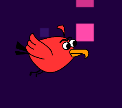

<div align="center">
    
    <h1 align="center">Flappy Bird Clone</h1>
</div>
This project reimagines the classic Flappy Bird concept

## Table of Contents

- [Demo](#demo)
- [Installation](#installation)
- [Contributing](#contributing)
- [License](#license)
- [Contact](#contact)

## Demo

[Playable WebGL Build](https://play.unity.com/mg/other/build-1-m-11)

## Installation

You should have install git and git lfs for this project.

1. Clone the repository

```bash
git clone https://github.com/LakshayManglani/flappy-bird.git
```

2. Open the project in the unity

## Contributing

Contributions are welcome! If you have any improvements, or bug fixes, feel free to submit a pull request.

## License

This project is licensed under the MIT License. See the [LICENSE](./LICENSE) file for details.

## Contact

For any inquiries or feedback, please reach out to us using the following email addresses:

[@LakshayManglani](https://github.com/LakshayManglani):
**[lakshaymanglani2212@gmail.com](mailto:lakshaymanglani2212@gmail.com)**
